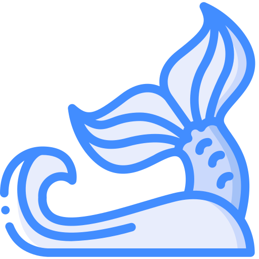

<div align="center">
  

  # 🌊 Hiro's Marine Application
  
  **A gamified educational desktop platform for marine conservation and sustainable ocean resources.**
</div>

---

## 📖 Tentang Aplikasi

**Hiro’s Marine** adalah sebuah aplikasi desktop berbasis JavaFX yang berfokus pada pelestarian dan pemanfaatan berkelanjutan sumber daya kelautan dan samudera (utamanya di wilayah Jawa) melalui pendekatan edukatif dan interaktif. 

Aplikasi ini bertujuan untuk meningkatkan kesadaran lingkungan laut serta memotivasi penggunanya untuk berkontribusi secara nyata dengan membangun rasa kompetitif yang sehat dan kepedulian komunitas.

---

## ✨ Fitur Utama (Key Features)

- **📚 Ensiklopedia Flora & Fauna Laut (Marine Encyclopedia):** Akses informasi terkini seputar keberlanjutan ekosistem laut.
- **📰 Berita & Artikel Edukatif (News & Articles):** Baca artikel pengetahuan, tonton video interaktif, dan dapatkan berita terbaru terkait kelautan.
- **🎮 Tantangan Kompetitif (Gamified Challenges):** Ikuti misi pelestarian lingkungan laut (seperti membersihkan pantai) dan bersaing di *leaderboard antarkota*.
- **📍 Rekomendasi Lokasi (Discovery & Contributions):** Unggah, nilai, dan rekomendasikan tempat wisata atau area kawasan konservasi laut potensial dengan berbagi pengalaman melalui foto serta koordinat lokasi.
- **👥 Manajemen Pengguna & Admin:** Profil pengguna interaktif beserta panel admin lengkap untuk memodifikasi tantangan, spesies laut, berita, dan mengelola pengguna.

---

## 🛠️ Teknologi yang Digunakan (Tech Stack)

Aplikasi ini dibangun menggunakan tumpukan teknologi modern untuk aplikasi Java Desktop:
- **Core:** Java 17 / 22
- **UI Framework:** JavaFX 22 & Gluon Charm Glisten
- **Styling & Forms:** FormsFX
- **Database:** MySQL 8.0.33
- **Connection Pooling:** HikariCP
- **Asynchronous Data:** RxJava3
- **Caching:** Caffeine
- **Utilities:** ZXing (Barcode/QR processing), SLF4J (Logging), Spring Boot Starters (Untuk test dan dependensi utilitas)

---

## ⚙️ Persyaratan Sistem (Prerequisites)

Sebelum menjalankan aplikasi, pastikan sistem Anda telah ter-install:
- [Java Development Kit (JDK) 17](https://jdk.java.net/17/) atau yang lebih baru.
- [Apache Maven](https://maven.apache.org/) (versi 3.6+).
- [MySQL Server](https://dev.mysql.com/downloads/mysql/) yang berjalan di sistem Anda.

---

## 🚀 Instalasi dan Konfigurasi (Setup & Run)

### 1. Kloning Repositori
```bash
git clone https://github.com/seipaa/Hiro-Marine-Application.git
cd Hiro-Marine-Application
```

### 2. Konfigurasi Database (MySQL)
Secara default, aplikasi mengharapkan kredensial dan konfigurasi database berikut (berada di kelas `utils.ConnectionPool.java`):
- **Database Name:** `hiros_marine`
- **Port:** `3300` (silakan sesuaikan jika MySQL Anda di port `3306`)
- **Username:** `root`
- **Password:** `humility`

**Langkah:**
1. Buka MySQL Anda (via terminal/XAMPP/MySQL Workbench).
2. Buat database: `CREATE DATABASE hiros_marine;`
3. Impor skema SQL jika tersedia.
4. *Penting:* Jika kredensial lokal Anda berbeda, buka *file* `src/main/java/utils/ConnectionPool.java` dan perbarui konfigurasi `HikariConfig` Anda.

### 3. Build & Run Aplikasi
Gunakan Maven wrapper bawaan untuk menjalankan aplikasi:
```bash
# Untuk membersihkan dan meng-compile project
mvn clean install

# Untuk menjalankan JavaFX App
mvn javafx:run
```


## 🗂️ Struktur Proyek

Berikut adalah kilasan letak *source code* utama di dalam direktori `src/main/java`:
- 📂 `controllers/`: Mengelola *logic view* JavaFX (Login, Admin, User Profile, Challenge).
- 📂 `models/`: Objek kelas data utama (User, Admin, Challenge, MarineSpecies, Lokasi, dll).
- 📂 `utils/`: Utilitas aplikasi termasuk koneksi Database dengan `ConnectionPool`.
- 📂 `dao/`: Objek akses data (Data Access Object) untuk eksekusi kueri ke basis data.
- 📄 `HiroMarineApp.java`: *Entry-point* (kelas utama) dari aplikasi desktop ini.

Desain Layout antarmuka berada di `src/main/resources/fxml/`.

---

<div align="center">
  <sub>Dibuat dengan ❤️ untuk Kelestarian Ekosistem Laut.</sub>
</div>
